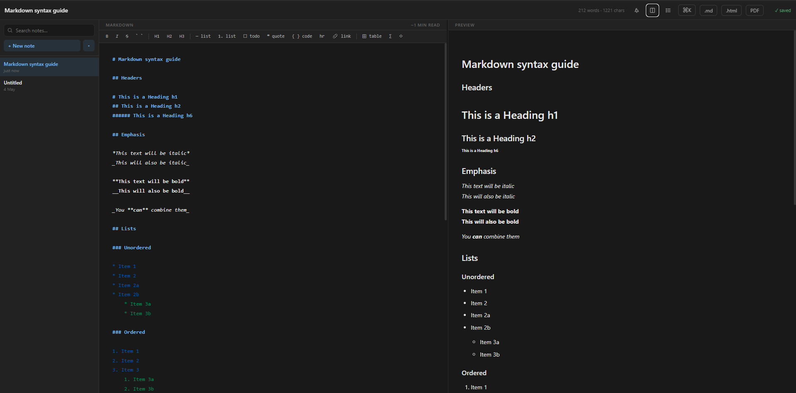

# Notion-lite — Markdown Editor

A production-ready, offline-first Markdown editor built with:

- **CodeMirror 5** — editor engine with Markdown syntax highlighting
- **marked.js** — fast Markdown → HTML parsing with GFM support
- **DOMPurify** — sanitises rendered HTML to prevent XSS
- **IndexedDB** (raw, no Dexie) — persistent offline storage

---

## Getting started

No build step. No npm install. Just open the file.

```bash
open index.html
# or serve locally for best results:
npx serve .
```

> IndexedDB works over `file://` in most browsers, but a local server
> avoids any quirks (Chrome in particular).

---

## Features

| Feature | Detail |
|---|---|
| Editor | CodeMirror 5 with Markdown mode |
| Live preview | Debounced at 150ms, sanitised HTML |
| Auto-save | Debounced at 500ms after last keystroke |
| Storage | IndexedDB — survives page refresh |
| Multiple notes | Create, switch, delete from sidebar |
| Export | `.md` (raw) and `.html` (standalone) |
| Toolbar | Bold, italic, headings, lists, code, table |
| Keyboard shortcuts | `Ctrl/Cmd+B`, `Ctrl/Cmd+I`, `Ctrl/Cmd+S` |

---

## Architecture

```
User types
    ↓
CodeMirror (onchange)
    ↓
debounce(150ms) → updatePreview()   →  marked.parse() → DOMPurify → DOM
debounce(500ms) → saveNote()        →  IndexedDB.put()
```

---

## Data model

```ts
type Note = {
  id:        string   // random base-36 uid
  title:     string   // editable, auto-derived from first heading
  content:   string   // raw Markdown
  createdAt: number   // Unix ms
  updatedAt: number   // Unix ms — used for sort order
}
```

---

## File structure

```
notion-lite/
└── index.html     # entire app — HTML + CSS + JS, CDN deps
```

---

## CDN dependencies

All loaded from `cdnjs.cloudflare.com`. The app requires an internet
connection on first load; once the browser caches the scripts it will
work offline (notes are already in IndexedDB).

| Library | Version | Purpose |
|---|---|---|
| CodeMirror | 5.65.16 | Editor + Markdown mode |
| marked | 4.3.0 | Markdown parser |
| DOMPurify | 2.4.0 | HTML sanitiser |

---

## Extending

**Add remark plugins** — swap `marked` for the `remark` + `remark-html`
pipeline and add plugins (`remark-gfm`, `rehype-highlight`, etc.).

**Add scroll sync** — on CodeMirror `scroll`, read
`editor.getScrollInfo()` and mirror the ratio to the preview pane.

**PWA / offline** — add a `manifest.json` and a service worker that
pre-caches the CDN scripts.

**Collaboration** — replace the IndexedDB layer with a CRDT (e.g.
Yjs) and a WebSocket transport.

---


